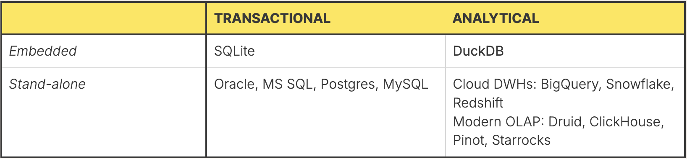

# DuckDB

## What is DuckDB

DuckDB is an in-process SQL OLAP database management system.
It's designed to be fast, embeddable, and easy to use—especially for analytical workloads.

(source: https://motherduck.com/blog/duckdb-enterprise-5-key-categories/)

Materials

- https://duckdb.org/
- https://motherduck.com/blog/ (what is MotherDuck: DuckDB-powered Cloud Data Warehouse Scaling to Terabytes with Ease)

## When to use DuckDB

- Ad-hoc analytics
  - Moderately large data (GBs to TBs)
  - Interactive
  - Replacing complex pandas pipelines
- Local development or client-side analytics
- Embedded analytics tools or APIs

### When not to use DuckDB

- Require distributed computation for massive-scale datasets
- Real-time streaming ingestion or processing
- Multi-user concurrency control or transactional consistency across services

#### Big Data is Dead?

(source: https://motherduck.com/blog/redshift-files-hunt-for-big-data/)

Materials

- https://motherduck.com/blog/big-data-is-dead/

### Overview of solutions in big data

| **Use Case**                             | **Solution**               |
| ---------------------------------------- | -------------------------- |
| **Operational pipelines (ingestion)**    | Spark, Flink               |
| **Interactive analytics over lakehouse** | Trino, StarRocks           |
| **Quick debugging/local analysis**       | DuckDB directly on Parquet |
| **Data science notebooks**               | DuckDB                     |
| **Embedded analytics**                   | DuckDB                     |

## DuckDB limitations

| **Category**           | **Limitation**                                                                |
| ---------------------- | ----------------------------------------------------------------------------- |
| **OLTP Workloads**     | Not suitable for frequent inserts/updates, transactions, or concurrent writes |
| **Memory Handling**    | Must fit data in memory (or stream efficiently); not for petabyte-scale data  |
| **Data Governance**    | Files can be queried directly, bypassing any catalog or metadata enforcement  |
| **Integration Limits** | Not a drop-in replacement for distributed engines (e.g., Spark, Hive, Trino)  |

## DuckDB examples

- [Lightweight Text Analytics Workflows with DuckDB](https://duckdb.org/2025/06/13/text-analytics.html)
- [Discovering DuckDB Use Cases via GitHub](https://duckdb.org/2025/06/27/discovering-w-github.html)
