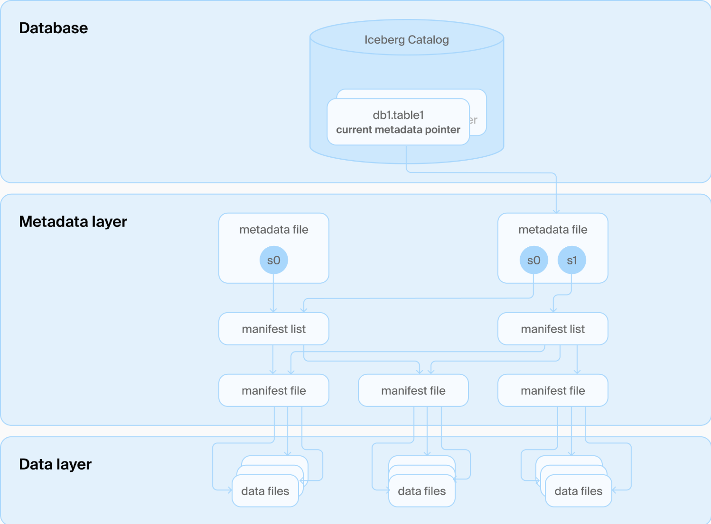
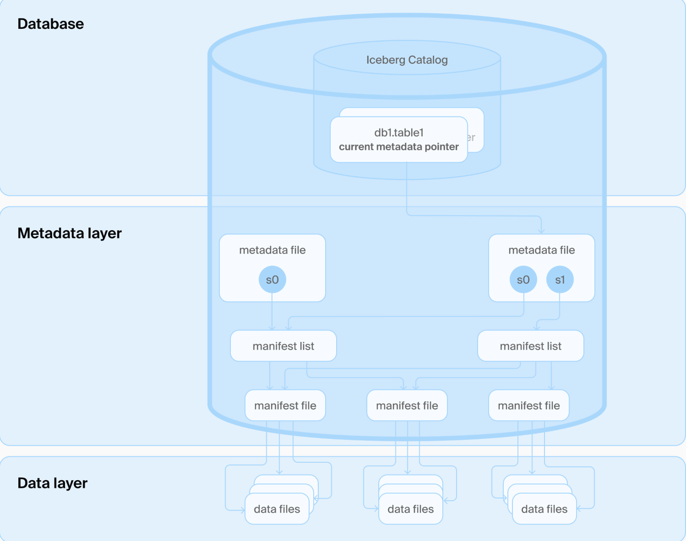

# DuckLake

https://motherduck.com/blog/getting-started-ducklake-table-format/

Release blog:

- https://duckdb.org/2025/05/27/ducklake.html
- https://duckdb.org/2025/07/04/ducklake-02.html

## Background

Iceberg structure

- Manifest Structure Complexity  
  Iceberg's use of multiple layers of manifest files adds complexity to the metadata structure. While this design improves scalability, it can be difficult to manage and debug.
- High Communication Overhead When Reading Manifests  
  Query engines must read multiple manifest and manifest list files to plan a query, leading to non-trivial I/O and communication overhead, especially in remote storage setups.
- External Dependency for Transaction Management  
  Although Iceberg supports atomic operations, it typically relies on an external metastore or catalog (e.g., Hive Metastore, AWS Glue, or a relational database) to track metadata versions.

## DuckLake's solution

- Store data files in open formats on external storage.
- Move all metadata structures into a SQL database, both for catalog and table data.
- Simplicity: no Avro or JSON files, it’s all just SQL.

## Limitation

- Immaturity of the Ecosystem
- Tight Coupling with DuckDB
- Lack of Distributed Support
- Limited Transaction Isolation and Concurrency
