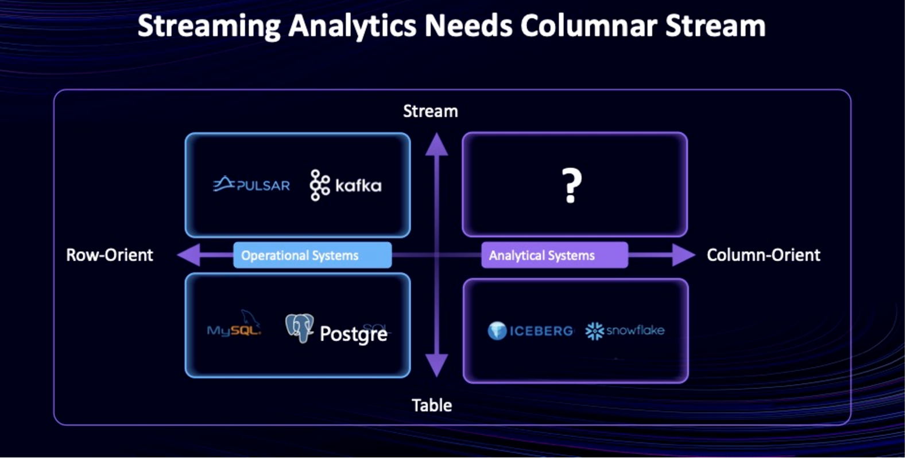
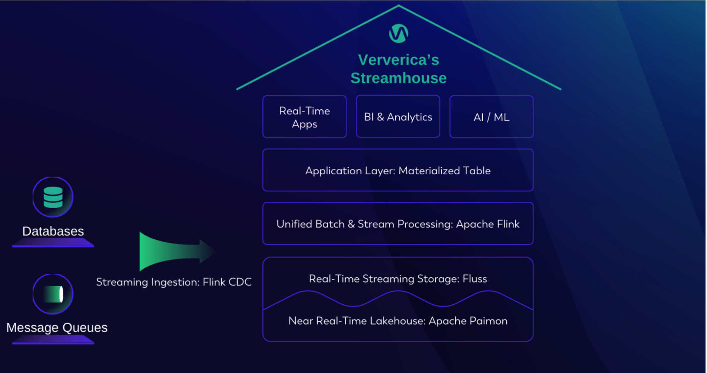
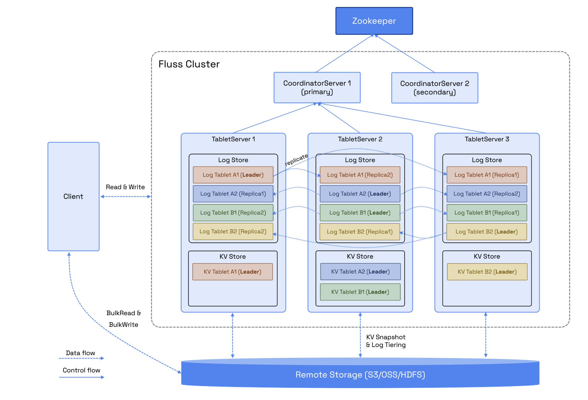
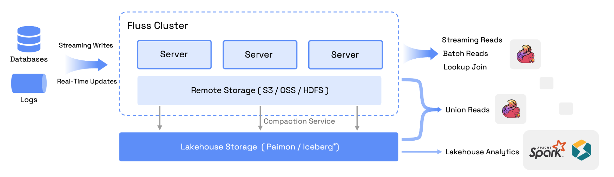

# Fluss - FLink Unified Streaming Storage
Streaming **Storage** for _Real-Time Analytics_

Fluss is a streaming storage built for real-time analytics which can serve as the real-time data layer for Lakehouse architectures.

Open Source from Novemver 29, 2024
https://alibaba.github.io/fluss-docs/blog/fluss-open-source/

Features
- Sub-Second Latency
- Columnar Stream
- Streaming & Lakehouse Unification
- Real-Time Updates
- Changelog Generation & Tracking
- Lookup Queries


# Introduction
## How is Fluss positioned


### Compare with Kafka
- Kafka is designed for **streaming events** 
- Fluss is designed for **streaming analytics**

Kafka pain points when serving as an "analytics" serverice
- No Support for Updates
- Lack of Querying Capabilities
- Difficulty with Data Backfilling
- Excessive Network Costs

### Compare with Paimon
- Fluss is a real-time streaming storage layer, optimized for data analytics and sub-second query freshness.
- Paimon is a near real-time Lakehouse format with native support for large-scale updates and CDC ingestion, while also offering Iceberg compatibility to ensure harmony with the current Lakehouse ecosystem.
- Paimon supports more interactive methods

### Use in Ververica to build Streamhouse



## How is Fluss structured
Optional components
- Remote Storage
- Lakehouse Storage




### Lakehouse Unification
- data in Fluss cluster serves real-time data layer which retains days with sub-second-level freshness
- the data in Lakehouse serves historical data layer which retains months with minute-level freshness

## Pain points
- FlinkSQL by now is the only officially supported interactive client
- Supported Flink version is 1.18 or higher
- Read/Write can only be done via tables
- Unexpected error and no mature solution when/for read and write

# Hands-on
You can get full examples here: https://alibaba.github.io/fluss-docs/docs/quickstart/flink/

```bash
docker compose exec jobmanager ./sql-client

# Check 3 pre-created table: source_customer, source_order, source_nation
SHOW CREATE TABLE source_customer;

# create a Fluss catalog
CREATE CATALOG my_fluss WITH (
    'type' = 'fluss',
    'bootstrap.servers' = 'coordinator-server:9123'
);

USE CATALOG my_fluss;

# create a table fluss_order
CREATE TABLE fluss_order (
    `order_key` BIGINT,
    `cust_key` INT NOT NULL,
    `total_price` DECIMAL(15, 2),
    `order_date` DATE,
    `order_priority` STRING,
    `clerk` STRING,
    `ptime` AS PROCTIME(),
    PRIMARY KEY (`order_key`) NOT ENFORCED
);

# streaming into fluss
EXECUTE STATEMENT SET
BEGIN
    INSERT INTO fluss_order SELECT * FROM `default_catalog`.`default_database`.source_order;
END;

# Check result
SET 'sql-client.execution.result-mode' = 'tableau';
SET 'execution.runtime-mode' = 'batch';
SELECT * FROM fluss_order LIMIT 2;
```


# Reference
- Official doc: https://alibaba.github.io/fluss-docs/
- Introduction from ververica: https://www.ververica.com/blog/from-kappa-architecture-to-streamhouse-making-lakehouse-real-time
- Introduction from Alibaba: https://www.alibabacloud.com/blog/why-fluss-top-4-challenges-of-using-kafka-for-real-time-analytics_601879
- Git issues: https://github.com/alibaba/fluss/issues
